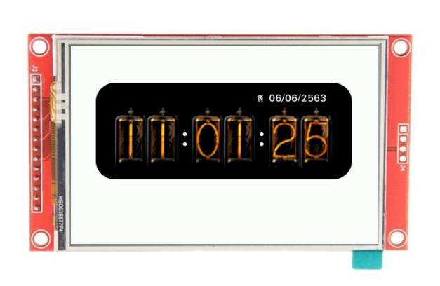

# BlynkGO_NixieClock
โปรเจค แสดง นาฬิกา ด้วย Nixie Tube  
พร้อมทั้ง เมื่อมีการกดที่นาฬิกาค้างจะทำการจับภาพหน้าจอ  
แล้วส่ง LINE Notify ภาพหน้าจอนั้น

<p align=center></p>
<p align=center></p>

## การติดตั้งก่อน compiled
1. ให้ copy รูปภาพใน folder `sd` ไปวางบน SD card ของบอร์ด BlynkGO
2. เปิด ArduinoIDE เปิด code โปรเจคนี้ขึ้นมา แล้ว compile

## Code

```cpp
#include <BlynkGO.h>
#include <TridentTD_LineNotify.h>  // download ได้ที่ https://github.com/TridentTD/TridentTD_LineNotify
#include "NixieClock.h"


#define BLYNKGO_KEY           "----------------"

#define SSID                  "----------------"
#define PASSWORD              "----------------"
#define LINE_TOKEN            "----------------"


void capture_notify();

void setup() {
  Serial.begin(115200); Serial.println();
  BlynkGO.begin(BLYNKGO_KEY);
  BlynkGO.fillScreen(TFT_WHITE);

  WiFi.begin(SSID, PASSWORD);     // เริ่มเชื่อมต่อสัญญาณ WiFi
  LINE.setToken(LINE_TOKEN);      // กำหนด Line Notify Token

  // สร้าง NixieClock
  GObject *nixie_clock = NixieClock::create();

  // เมื่อมีสัญญาณกดค้างยาว
  nixie_clock->onLongPressed([](GWidget*w){
    Serial.println("Capture Notify!!");
    capture_notify();     // จับภาพหน้าจอ และส่ง LINE Notify
  });
  
}

void loop() {
  BlynkGO.update();

}

WIFI_CONNECTED(){
  Serial.print("WiFi Connected. IP : ");
  Serial.println(WiFi.localIP());
}

NTP_SYNCED(){
  static GTimer clock_timer;
  clock_timer.setInterval(1000L,[](){
    static time_t now;
    static struct tm tm;
    time(&now); localtime_r(&now, &tm);
    NixieClock::setTime(tm);
  });
}

void capture_notify(){
  static uint8_t capture_counter =1;
  char filename[128];
  snprintf(filename, 128, "SD://BlynkGO/captures/nixieclock_%02d.png", capture_counter);
  BlynkGO.capture( filename);
  LINE.notifyPicture( SD, StringX::printf("/BlynkGO/captures/nixieclock_%02d.png", capture_counter ++).c_str() );
}


```
